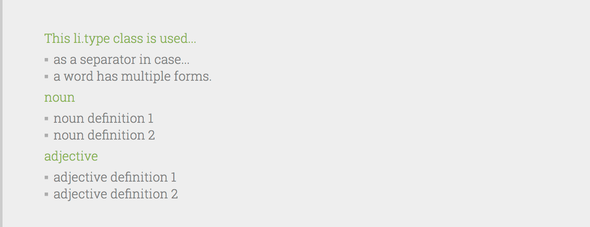
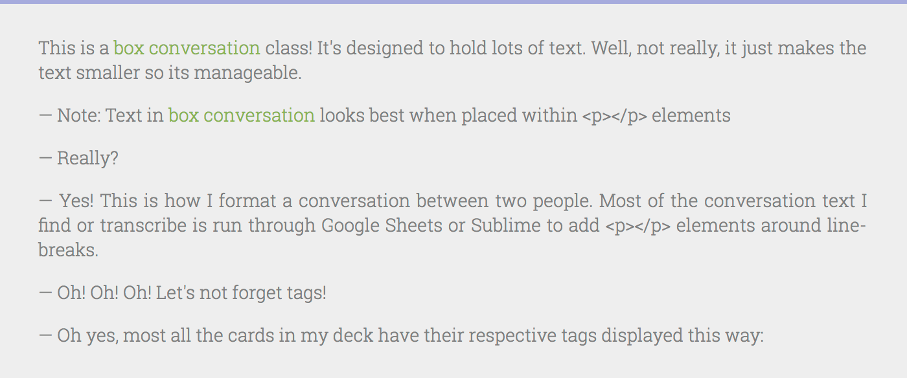

# anki_style

A live version of anki_style can be seen here: https://tnahs.github.io/anki_style/

Each of these boxes you see here are part of a standardized style sheet I've developed over the past year or so while using Anki. It by no means is an exhaustive set of classes for all situations but it covers the basic cards for when learning a language. Namely reviewing: vocabulary, sentences, and conversations. However, most of these classes, if not all, can also be used with any type of card, it's really not limited to languages or any specific topics.

The motivation behind this was that I was looking for a way to flexibly format and re-format my cards. Removing almost all HTML and CSS from Anki ensures that I can change/edit/tweak the color palette or overall theme without having to sift through thousands of cards.

## Installation

**Required:** 
`anki_style.css`

**Optional:**
[Roboto Slab](https://fonts.google.com/specimen/Roboto+Slab) from Google Fonts

<br>

1. Copy `anki_style.css` to your `collections.media` folder. 

>Note: Make sure to add a leading underscore `_` to the filename. Because the style sheet is not explicitly referenced in any fields, Anki will see it as un-used media when `Tools>Check Media` is run. By adding a leading underscore Anki ignores the file when checking media.
>
>Thus: `_anki_style.css` will be in your `collections.media` folder.

The `collections.media` is located:
>On **Windows**, the latest Anki versions store your Anki files in your appdata folder. You can access it by opening the file manager, and typing` %APPDATA%\Anki2` in the location field. Older versions of Anki stored your Anki files in a folder called `Anki` in your `Documents` folder.
>
>On **Mac** computers, recent Anki versions store all their files in the `~/Library/Application Support/Anki2` folder. The Library folder is hidden by default, but can be revealed in Finder by holding down the option key while clicking on the Go menu. If you’re on an older Anki version, your Anki files will be in your `Documents/Anki` folder.
>
>On **Linux**, recent Anki versions store your data in` ~/.local/share/Anki2`, or `$XDG_DATA_HOME/Anki2` if you have set a custom data path. Older versions of Anki stored your files in `~/Documents/Anki` or `~/Anki`.
>
> https://apps.ankiweb.net/docs/manual.html#files

<br>

2. Add `@import 'anki_style.css';` to the `Styling` section of your note.

<br>

3. In the `Front Template` or `Back Template` of your `Card Types` window:  

- Create a div `<div></div>`
- Add a class attribute `<div class=""></div>`
- Assign a specific class from the list below. `<div class="box header hcolor"></div>`

<br>

4. Download [Roboto Slab](https://fonts.google.com/specimen/Roboto+Slab) and install using the method of your specific OS. https://apps.ankiweb.net/docs/manual.html#installing-fonts

<br>

## Classes

`box`:
```html
<div class="box">{{field}}</div>
```


Using an unordered list: 
```html
<ul>
  <li>This is how I format...</li>
  <li>multiple definitions.</li>
</ul>
```


Adding `type`:
```html
  <ul>
	<li class=type>This li.type class is used...</li>
	<li>as a separator in case...</li>
	<li>a word has multiple forms.</li>
	<li class=type>noun</li>
	<li>noun definition 1</li>
	<li>noun definition 2</li>
	<li class=type>adjective</li>
	<li>adjective definition 1</li>
	<li>adjective definition 2</li>
  </ul>
```


<br>


`question` box:
``` html
<div class="box question">{{field}}</div>
```

> For example: `<div class="box question">{{Quesion}}</div>` and a saved search such as: `Question:*_*` can be setup to return all cards with something in the `{{Quesion}}` field. I find it handy to compile a bunch of questions to ask a native speaker, or do research on at a later time.

<br>

`peek` box:

```html
<div class="box peek">{{field}}</div>
```
This takes any `box` class and makes the inner text invisible until a hover. It makes cards "three-sided." A sentence translation can be revealed on the back template only after someone has hovered over the box. For example, with a listening card, the back of a card can be revealed to confirm what was heard in the target language without revealing the translation.


<br>

`pic` box:
```html
<div class="box pic">{{field}}</div>
```


<br>


`header` box:
``` html
<div class="box header">{{field}}</div>
```


<br>


`header` box colored:
``` html
<div class="box header hcolor">{{field}}</div>
<div class="box header hgray">{{field}}</div>
```
This is a purely aesthetic adjustment to the top border color of the `header` class.


<br>


`conversation` box:
``` html
<div class="box conversation">{{field}}</div>
```
This is used only for conversation cards. Fonts are styled smaller along with some minor aesthetic adjustments. 



<br>

`tag` box:
```html
<div class="box tags"># {{field}}</div>
```
Faintly displays the current tags. 
>Note: Actual style does not have outline.


<br>

`hidden`:
Field contents are not rendered on card. Primarily used in two cases. Hide text that's being fed to AwesomeTTS and hide text being fed to a javascript function. In these cases I usually use a `<span></span>` instead of a `<div></div>`.
```html
<span class="hidden">{{field}}</span>
```
<br>


## Example

>Note: This first example assumes the use of [AwesomeTTS](https://ankiweb.net/shared/info/301952613) and a group of voices names "FrenchVoices" to generate on-the-fly audio for listening comprehension. See [AwesomeTTS Documentation](https://ankiatts.appspot.com/) for more on this.

```html
<!-- Front Template -->

<div class="box header hcolor">Écoute:</div>
{{^Audio}}<tts class="hidden" group="FrenchVoices">{{Phrase}}</tts>{{/Audio}}
{{#Audio}}{{Audio}}{{/Audio}}
```

```html
<!-- Styling (shared between cards) -->

@import '_anki_style.css';
```

```html
<!-- Back Template -->

<div class="box header hcolor">{{Phrase}}</div>
{{#Anglais}}<div class="box peek">{{Anglais}}</div>{{/Anglais}}
{{#Notes}}<div class="box">{{Notes}}</div>{{/Notes}}
{{#Question!}}<div class="box question">{{Question!}}</div>{{/Question!}}
{{#Tags}}<div class="box tags"># {{Tags}}</div>{{/Tags}}
```
